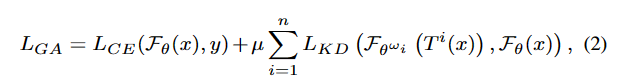
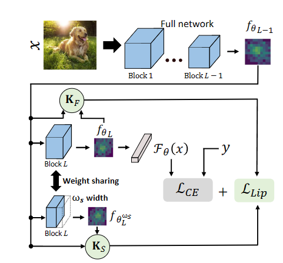

#! https://zhuanlan.zhihu.com/p/676687642
# 本地学习问题：重新思考联邦学习中的数据异质性
# Local Learning Matters: Rethinking Data Heterogeneity in Federated Learning   
## Intro
联邦学习(FL)[17]使大量客户能够在不损害数据隐私的情况下对机器学习模型进行协作训练。在FL设置中，参与的客户机通常部署在各种环境中，或者由一组不同的用户拥有。因此，每个客户机本地数据的分布可能会有很大差异(即数据异构性)。 因为客户端训练发生在它们自己的数据上，所以它们趋向于各自的局部最小值。然而，这个局部收敛点可能与全局模型的目标(即，通过中央服务器的聚合学习模型)不太一致。因此，客户端模型经常偏离理想的全局优化点，过度拟合其局部目标。当这种客户端漂移发生时，会阻碍中心聚合模型的性能[9,14]。  
对于这种现象，一个直接的解决方案是简单地限制在中心聚合步骤之间执行的局部训练epoch的数量。然而，这严重阻碍了FL系统的收敛速度，并且需要许多通信轮才能达到足够的性能。这种方法带来的收敛时间和巨大的通信开销对于真实的分布式系统来说通常是无法忍受的。因此，有效地解决数据异构是联邦学习中最重要的问题。  

文献[1,10,15,23]中已经提出了许多针对该问题的算法解决方案。这些策略通常侧重于通过引入各种近端约束项来限制相对于全局模型的本地更新，从而减轻客户机之间数据异构的影响。然而，通过抑制漂移，它们也固有地限制了局部收敛潜力;每个通信回合收集的新信息更少。因此，与经典基线相比，许多当前的FL算法在不同的非iid设置下不能提供稳定的性能改进[14,15]，特别是在超越MNIST难度的视觉任务上[13]。此外，现有的方法很少关注客户机的资源约束，这对于部署的FL边缘设备来说通常是稀缺的，并且在某些情况下，为了减轻客户机漂移，会在客户机上产生相当大的计算和/或内存开销。    

在集中式训练模式下，为了对抗过拟合，网络泛化能力得到了很好的研究。即使在训练数据和测试数据来自相似分布的标准设置中，如果不采取预防措施，模型仍然会对训练数据进行过拟合。当训练数据和测试数据分布不同时，这种效应进一步增强。引入各种正则化技术来加强训练过程中的学习通用性，并保持适当的测试性能。同样，对FL中每个设备的局部训练数据的过度拟合也不利于整体网络性能，因为客户端漂移效应会在局部模型之间产生冲突的目标。因此，在存在数据异质性的情况下，关注改进模型的通用性应该是主要关注的问题。在培训过程中提高局部学习的通用性会使客户的目标更接近整体的全球目标。然而，尽管有其直观的动机，这一观点却被当前大量的FL文献所忽视。  

因此，在本文中，我们提出了从局部学习一般性而不是近端限制的角度来重新思考数据异质性的方法。具体而言，我们仔细分析了各种数据和结构正则化方法在减少客户端漂移和提高FL性能方面的有效性(第3节)。利用二阶信息和来自分布外一般性文献[19,21]的见解，我们确定了成功的FL优化的理论指标，并评估了各种FL设置以进行经验验证。尽管一些正则化方法在减轻客户端漂移方面表现良好，但为了达到最佳性能，仍然会产生大量的资源开销(参见第4节)。因此，我们提出了FedAlign，这是一种基于蒸馏的正则化方法，它在保持优异的资源效率的同时促进了局部学习的一般性。具体来说，FedAlign专注于正则化网络中最后一个块的Lipschitz常数。通过只关注最后一个块，我们有效地规范了网络中最容易过度拟合的部分，并将额外的资源需求降至最低。因此，FedAlign在各种FL设置的多个数据集上实现了最先进的精度，同时与其他最先进的方法相比，所需的计算和内存开销显着减少。  

本文的贡献如下：  
+ 我们从一个比以往任何其他工作都独特的角度来处理最棘手的FL挑战之一(即由数据异构引起的客户端漂移)。我们不关注重参数化技巧以保持与中心模型的接近，或调整聚合方案以减轻非iid数据分布的影响。相反，我们建议从基本的机器学习训练原则重新思考这个问题。通过这种方式，我们分析了标准正则化方法在FL上的性能及其对数据异质性的有效性。  
+ 我们不仅从经验上分析了正则化方法在FL中的性能，我们还建议进行更深入的研究。具体地说，我们用学习一般性的理论指标来告知我们的分析，以深入了解哪种方法是最好的，为什么是最好的。我们发现Hessian特征值/轨迹测量和客户端的Hessian匹配是最优FL方法的有意义的指标。此外，我们在各种FL设置下进行了彻底的消融研究，以了解不同方法的经验效应。我们的目标是为FL社区提供这些有价值的知识，以激发新的、富有成效的研究方向。   
+ 根据我们的分析和检查以前方法的缺陷，我们提出了FedAlign，它在保持内存和计算效率的同时实现了具有竞争力的最先进的精度。  

## 2.Related Work  
然而，这些方法有两个主要缺点。首先，通过抑制漂移，它们也固有地限制了局部收敛潜力。这样，每个通信回合收集的新信息就不多了。其次，这些方法中的许多都会在内存和/或计算方面产生大量开销。例如，由于模型的约束损失，MOON[15]需要在训练过程中同时在内存中存储三个全尺寸模型，并在每次迭代中向前遍历每个模型。这需要大量的额外资源，而这些资源在FL客户端设置中通常已经很稀缺了。  
其他工作集中在系统的服务器端，旨在改进聚合算法。[34]提出了一种贝叶斯非参数方法来匹配局部模型中的神经元，而不是简单的平均。然而，所提出的框架在全连接网络中的应用受到限制，因此[27]将其扩展到cnn和lstm。FedNova[28]提出了一种标准化的平均方法，作为简单的fedag更新的替代方法。由于我们关注的是本地培训，这些工作与我们的工作是正交的。一些方法[18,25,32]提出了受数据增强方法Mixup启发的联邦方案，对局部数据使用类似的平均技术，并与全局模型或其他设备共享增强的数据。然而，尽管数据在分发之前以某种方式进行了扩充，但是共享来自客户机的私有数据对于隐私保护来说并不理想。此外，共享额外的数据会加重系统的通信负担，这是FL的主要关注点。  
在传统的集中训练中，为了提高通用性，通常采用各种形式的正则化训练。数据级正则化，包括基本的数据增强和其他更高级的技术[33,36]，被认为是非常有效的。其他方法通过结构修改在训练过程中引入一定程度的噪声;例如，对网络连通性的随机或故意修改[3,6,26]。[29]提出了一种混合方法，通过使用子网络表示、知识蒸馏和输入变换，将自引导梯度扰动引入训练过程。作为这项工作的一部分，我们在许多FL设置中使用了各种正则化方法并且与最先进的FL算法相比，分析它们的性能。  

## 3.实证研究  
我们希望从一个简单而独特的局部学习一般性的角度来评估FL的数据异质性挑战。具体来说，我们首先研究了标准正则化技术作为解决这一FL挑战的有效性，并与最先进的方法进行了比较。  
三种正则化技术：  
+ Mixup：一种数据级增强技术，它在两个样本之间执行线性插值。给定两个样本对$(x_i,y_i)$和$(x_j,y_j)$，将他们进行插值从而组合为$x' = \beta x_i + (1-\beta) x_j, y' = \beta y_i + (1-\beta)y_j, \beta \sim Beta(\gamma, \gamma)$  
+ StochDepth: 随机深度 (StochDepth) 是一种基于结构的方法，在训练期间丢弃层，从而创建不同有效长度的隐式网络集成。  
+ GradAug: GradAug 是最近的正则化方法，它结合了蒸馏框架中的数据级和结构技术。它的训练损失定义为  

具有较低的 λmax 和 HT 通常会产生对网络权重中的小扰动不太敏感的网络。这具有在训练期间平滑损失空间的有益效果，达到更平坦的最小值并缓解收敛。这些属性在联邦学习中特别有利，其中极端的非 IID 分布和有限的本地数据通常会使收敛变得困难。  

特征值/轨迹分析和Hessian匹配准则都可作为最优FL方法的引导指标。特别是，它们提供了对收敛和聚合彻底景观平滑度和一致性的促进的洞察。  

## 4.FedAlign  
总体而言，我们发现 GradAug 在 FL 设置中特别有效，在所有测试场景中具有最高的准确性以及最低的 λmax、HT 和 HN。然而，虽然与许多 FL 方法相比，这种方法的内存效率相当（在训练期间只需要单个存储模型），但它确实会导致 FedAvg 基线的训练时间和局部计算显着增加。因此，问题是，我们能否设计一种在 FL 中提供与 GradAug 相似的效果和性能的方法，但计算开销大大减少。这在 FL 设置中尤其重要，其中客户端通常是以最少的内存和计算资源部署设备。  

为此，我们首先注意到我们分析期间收集的以下见解：1）二阶信息对于理解神经网络的学习普遍性是有见地的。特别是，我们发现该领域的平坦度和一致性是理想的特征。2）在实践中，我们发现结构正则化，尤其是像 GradAug 这样的基于蒸馏，非常有效。此外，与其他方法相比，这种方法的权重共享机制具有内存效率，这些方法依赖于全局模型或以前的模型存储。因此，我们将这些见解结合到一种新的算法中，以优化 FL 中的性能和资源需求。  

我们提出了FedAlign，这是一种基于蒸馏的正则化方法，通过使用精简子块来对齐最关键网络组件的Lipschitz常数(即最大Hessian特征值)。  

  
+ 首先，受第 3.4 节的见解的启发，我们在内部规范网络块的 Liptschitz 常数以促进模型中的平滑优化和一致性。  
+ 其次，为了以有目的的方式减少计算，我们注意到某些网络属性。特别是，研究表明，神经网络的最后一层最容易与客户端分布过拟合[16]。因此，我们设计FedAlign的重点是网络中的这些关键点。我们提出的问题是，当我们的目标是将我们的正则化工作集中在最后一层时，为什么我们要从头到尾运行所有的子网络进行蒸馏?相反，我们建议重用整个网络的中间特征，以减少宽度的方式将其作为最终块的输入，从而显著减少计算量。通过这种方式，我们利用了基于蒸馏的正则化在性能和内存占用方面的好处，同时有效地减少了计算开销。  
+ 